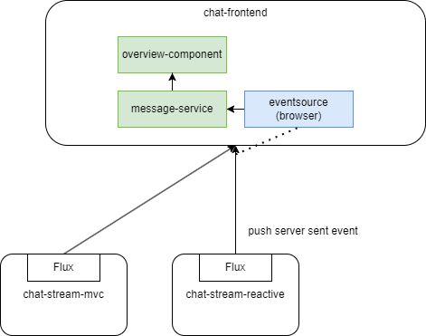
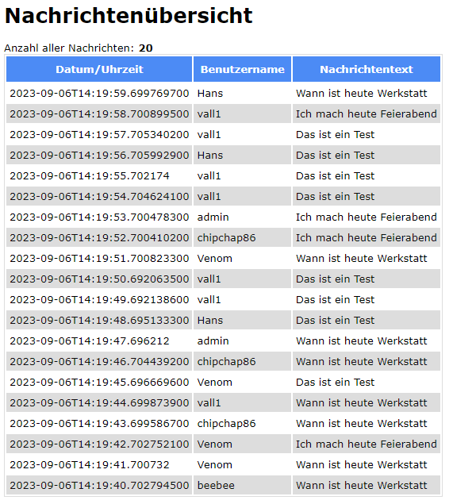
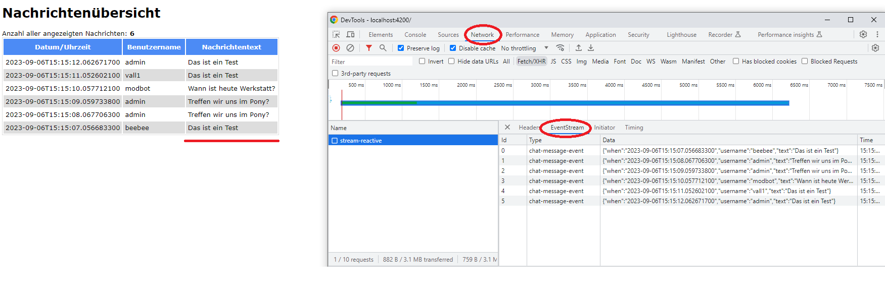

# ChatFrontend

## Sind und Zweck
* Demoprogramm für den Umgang mit ServerSentEvents (SSE) in angular

## Bausteinsicht

## Kurzerklärung
* Genutzt wird die Browser-API rund um `EventSource`
* Diese wird in ein Observable verpackt, welches feuert, wenn vom Backend ein event `chat-message-event` ankommt
* Der ankommende Text wird als JSON interpretiert, in ein Objekt gewandelt und dann in einer Tabelle `Nachrichtenübersicht` angezeigt

## Lokales Ausführen
* `ng serve`
* Im Browser http://localhost:4200

## LiveStream in Chrome verfolgen

